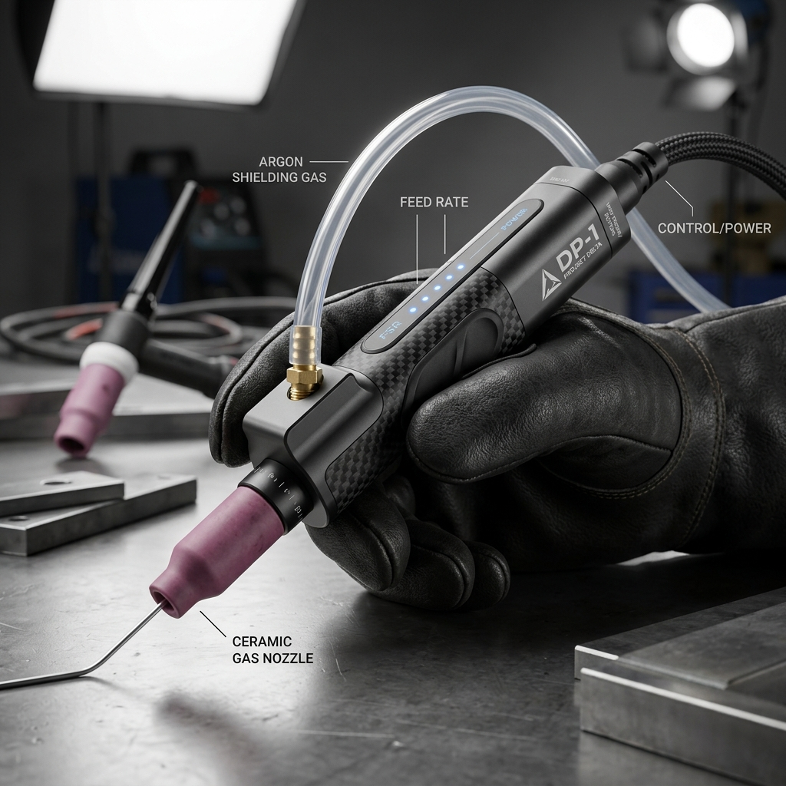
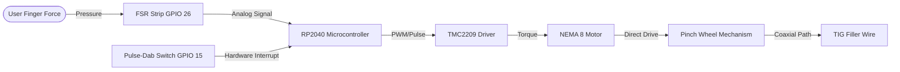

# Project Delta Pen (DP-1)
> **STATUS: ACTIVE R&D**  
> High-precision, ergonomic, motorized coaxial TIG filler wire feeder powered by RP2040 and closed-loop force sensing feedback.



---

## System Overview

Project Delta Pen (DP-1) is a handheld, motorized welding wire feeder designed to streamline TIG wire deposition. Featuring a lightweight, coaxial wire feed path and an integrated Force Sensitive Resistor (FSR) index grip, the DP-1 responds dynamically to user finger pressure, outputting precise wire feed rates directly into the weld puddle.




---

## Directory Structure

```text
peaceful-franklin/
├── .gitattributes          # LFS tracking configurations
├── .gitignore              # Dependency and build exclusions
├── LICENSE                 # MIT Open Source License
├── README.md               # High-level architecture and mechanical logic
├── BUILD.md                # Component sourcing and assembly guide
├── docs/                   # Detailed technical breakdowns
│   ├── specs.md            # Hardware tolerances and power curves
│   └── user_manual.md      # Calibrations and operation guide
├── cad/                    # Parametric CAD models
│   ├── chassis.scad        # Ergonomic handheld shell design
│   └── drive_gear.scad     # V-groove pinch wheel models
├── firmware/               # Microcontroller firmware
│   └── main.py             # CircuitPython RP2040 control loop
└── assets/                 # Schematics and visual guides
    ├── chassis_render.png  # High-fidelity industrial design mockup
    └── connection_map.png  # Wiring diagrams
```


---

## Mechanical Logic

The DP-1's mechanical efficiency relies on two primary innovations: its **coaxial wire feed path** and the **direct-drive pinch mechanism**.

```
             [ NEMA 8 Motor ]
                   │
                   ▼ (Direct Drive shaft)
           [ V-Groove Wheel ] <--- (Pinch Force) ---> [ Bearing Tensioner ]
                   │
                   ▼
===================[ Coaxial Wire Feed Guide Tube ]===================
==== Wire ==========================================================>
```

### 1. Coaxial Wire Feed
Traditional motorized wire feeders feed wire off-axis, creating rotational torque that causes hand fatigue during long welding runs. The DP-1 routes the filler wire directly through the centerline axis of the pen-like body. The wire exits the rear, travels through a flexible PTFE guide sheath, passes through the motor chassis, and exits straight out of the nozzle. This eliminates off-axis drag and maintains optimal ergonomics.

### 2. Direct-Drive Pinch Mechanism
To feed 1.6mm to 3.2mm aluminum or stainless steel wire without slipping, the chassis houses a high-torque **NEMA 8 stepper motor** mated to a custom-grooved **V-Groove drive wheel**. A secondary spring-loaded guide bearing pinches the wire against the V-groove. This direct coupling ensures zero backlash, high driving torque, and instant startup/stop response.

---

## Firmware Overview

The system runs a modular control loop implemented in CircuitPython on the RP2040. Features include:
* **Dynamic FSR Scaling**: Analog pressure mapping to feed rate.
* **Safety Pulse-Dab Switch**: Dedicated GPIO hardware interrupt to pause, retract, or pulse feed instantly, preventing runaway feeding.

For source details, see [firmware/main.py](file:///home/_____/Documents/antigravity/peaceful-franklin/firmware/main.py).
